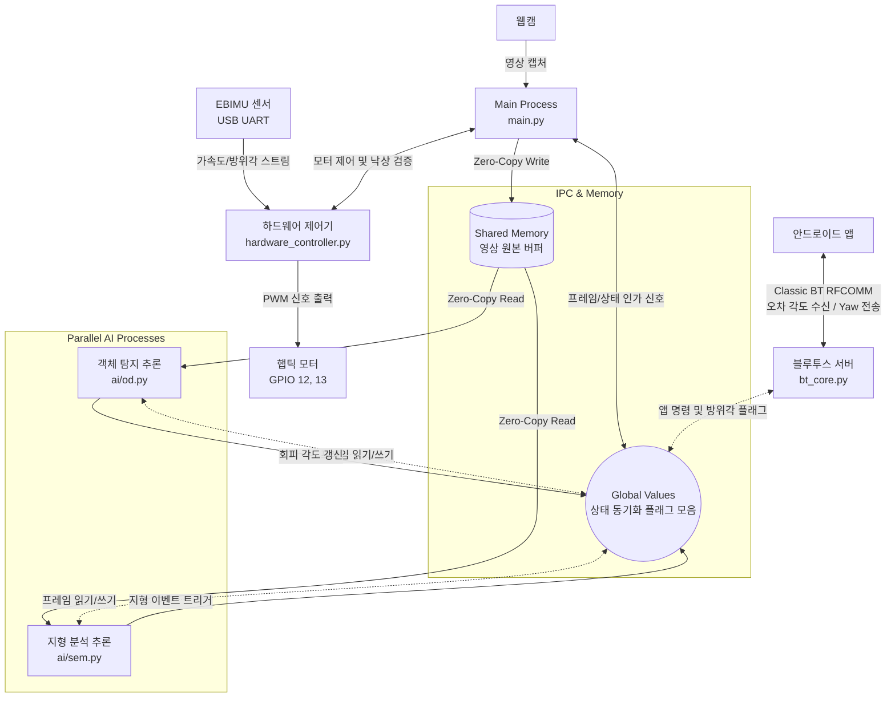

# 🍓 VIP-Wearable - RaspberryPi
라즈베리파이 5 기반의 시각장애인 보행 보조 자율주행 AI 및 멀티프로세싱 제어 시스템입니다.
카메라를 통해 수집된 영상으로 실시간 장애물 회피 및 지형 인식 AI를 구동하며, 스마트폰 앱(Classic Bluetooth)과의 통신, 그리고 IMU 센서 데이터 수집 및 햅틱 모터 제어까지 시스템의 모든 물리적/소프트웨어적 처리를 라즈베리파이 내에서 독립적으로 수행합니다.

## 🛠 기술 스택
* **Board:** Raspberry Pi 5 (4GB)
* **OS:** Raspberry Pi OS (64-bit)
* **Language:** Python 3.11+
* **AI & Vision:**  OpenCV, PyTorch, Ultralytics (YOLO26n / best_int8_freeze5.onnx), ONNXRuntime
* **Hardware Control:** lgpio (Motor PWM Control), pySerial (EBIMU Sensor UART)
* **Concurrency:** Multiprocessing (Shared Memory, Value), asyncio

## 💡 주요 구현 기능
### **1. 라즈베리파이 기반 통합 하드웨어 제어**
* **햅틱 모터 직접 제어 (`lgpio`):** 라즈베리파이의 하드웨어 PWM(GPIO 12, 13)을 이용하여 좌/우 햅틱 모터를 다이렉트로 제어합니다. AI 연산 결과와 경로 오차에 따라 즉각적인 비례제어 진동 피드백을 제공합니다.
* **USB IMU 센서 연동 (`pySerial`):** 외부 EBIMU 센서를 USB UART로 직접 연결하여 Roll, Pitch, Yaw 방위각 데이터를 초고속 파싱하며, 자체적인 낙상 감지 알고리즘을 통해 긴급 시 모터 최대 진동 경고를 수행합니다.

### **2. 공유 메모리(Shared Memory) 기반 제로카피 아키텍처**
* **프레임 복사 오버헤드 제거:** 카메라 캡처 영상을 `multiprocessing.shared_memory` 호스트 버퍼에 다이렉트 바인딩하여 메모리 병목 현상 해결
* **프로세스 간 상태 동기화:** 독립된 서브 프로세스(OD, SEM, 블루투스) 간의 제어 흐름을 `multiprocessing.Value` 플래그로 묶어 스레드 세이프하게 관리합니다.

### **3. 안정적인 Classic Bluetooth (RFCOMM) 통신 인프라**
* **BT 대안 고신뢰성 무선망:** 기존 BLE 방식의 잦은 단절 문제를 해결하기 위해 표준 Bluetooth Classic (RFCOMM Channel 1) 기반 소켓 통신을 도입하여 안드로이드 앱과 견고한 실시간 양방향 데이터(경로 오차 수신, 방위각 송신) 스트리밍망을 구축했습니다.

### **4. 듀얼 Vision AI 추론 모델 병렬 구동**
* **정적 장애물 회피 (OD):** 양자화 모델(`yolo26n.onnx`)을 통해 전방 장애물을 탐지하여 3방향 회피 알고리즘 구동
* **지형 분석 세그멘테이션 (SEM):** `best_int8_freeze5.onnx` 파인튜닝 모델로 차도, 보도블록, 횡단보도를 분석하고 필터를 통해 안정적인 상태 안내 수행


## 🏗 시스템 아키텍처



## 📂 폴더 구조
프로젝트는 코어 병렬 처리를 위해 프로세스 단위로 모듈화되어 있습니다.

```text
📦 vip_wearable_rasi
 ┣ 📜 main.py                    # 중앙 컨트롤러 
 ┣ 📂 ai                         # 인공지능 추론 엔진 모듈
 │  ┣ 📜 od.py                   # Object Detection 프로세스 (장애물 회피)
 │  ┣ 📜 sem.py                  # Semantic Segmentation 프로세스 (지형 분석)
 │  ┗ 📜 utils.py                # 위험도 맵핑, ROI 설정, 마스크 렌더링, FPS 유틸리티
 ┣ 📂 basic                      # 시스템 핵심 통신 및 하드웨어 인프라
 │  ┣ 📜 config.py               # 포트 번호, 해상도, 블루투스 채널 등 정적 환경 설정
 │  ┣ 📜 g_val.py                # 멀티프로세싱 프로세스 간 전역 상태 공유(Value) 객체 모음
 │  ┣ 📜 handler.py              # AI 이벤트에 따른 콘솔 및 상태 핸들러 로직
 │  ┣ 📜 hardware_controller.py  # IMU 파싱 및 lgpio 기반 햅틱 모터 PWM 다이렉트 제어
 │  ┗ 📜 bt_core.py             # 블루투스(RFCOMM) 서버 구축 및 앱 통신 비동기 루프
 ┣ 📂 doc                        # 라즈베리파이 환경설정 및 요구사항 가이드 문서
 ┣ 📂 models                     # ONNX 변환 및 INT8 양자화가 적용된 AI 가중치 폴더
 ┣ 📂 records                    # 네비게이션 가동 중 자동 녹화된 영상 저장소
 ┗ 📂 tools                      # 기타 프로젝트 유틸리티 스크립트 모음
```

## 📍 통신 및 인터페이스 구성

### ⚙️ 하드웨어 인터페이스 (IMU & Motor)
* **IMU 센서 (EBIMU):** 외부 USB 형태의 `UART`통신 채널인 `/dev/ttyUSB0`를 사용하여 115200 bps의 속도로 라즈베리파이와 연결됩니다. 
* **햅틱 좌측 모터:** 라즈베리파이 5의 자체 하드웨어 핀 `GPIO 12` (물리 32번)를 통해 1kHz 대역의 `PWM` (펄스 폭 변조) 신호로 제어됩니다.
* **햅틱 우측 모터:** 라즈베리파이 5의 자체 하드웨어 핀 `GPIO 13` (물리 33번)를 통해 1kHz 대역의 `PWM` 신호로 제어됩니다.

### 📡 무선 앱 연동망 (Classic Bluetooth)
* **프로토콜:** Bluetooth RFCOMM
* **할당 채널:** Channel 1
* **Device Name:** `VIP_Guide`
* 안드로이드 스마트폰 앱과 시리얼 통신을 에뮬레이트 하는 소켓 결합 방식으로 1:1 통신망을 구축합니다. 앱에서 전송하는 제어 패킷(`0x33`, `0x22`)을 수신하고, 시스템 내부에서 처리된 방위각 스트리밍 패킷(`0x11`)을 송신하는 양방향 통신 구조로 설계되었습니다.

## 🚀 시스템 동작 흐름 (State Flow)

### 1. **초기화 및 대기 모드 (System Initialization & Sleep)** 
사용자가 `main.py`를 실행하면 시스템의 핵심 구동이 시작됩니다. 
* 카메라 센서, 햅틱 모터 핀, 그리고 서브 프로세스 (OD, SEM 추론 엔진)가 할당되며 활성화됩니다.
* 통신 인터페이스인 블루투스 소켓이 개방되어 스마트폰 앱과의 페어링 연결을 기다리는 Sleep 상태 (자원 절약 및 대기 상태) 로 유지됩니다.

### 2. **스마트폰 앱 연결 및 제어 상태 수신** 
사용자가 앱을 통해 블루투스 연결을 완료하면, 상태를 제어하는 명령 패킷(`0x33`)을 수신하여 동작 모드를 전환합니다.
   * **Sleep (`0x00`):** 사용자가 앱을 강제 종료하거나 연결이 단절된 상황입니다. AI 추론이 정지되고 모터 출력이 0으로 비활성화됩니다.
   * **Wake (`0x01`):** 앱과 정상적으로 연결되었으나 아직 목적지를 입력하지 않은 기본 대기 상태입니다. 
   * **Navigation (`0x02`):** 앱에서 목적지를 입력받아 내비게이션 경로 탐색이 시작된 상태입니다. 카메라 영상 버퍼가 시스템 메모리에 바인딩되며 AI 비전 모델이 전방 상황을 추론하기 시작합니다.

### 3. **다이렉트 모터 피드백 기반 보행 가이드 구동** 
내비게이션 모드가 활성화되면, 스마트폰 앱에서 수신한 경로 오차 각도(`0x22` 패킷, 최댓값 100도)를 기반으로 `hardware_controller.py` 모듈이 작동합니다.
* 모터의 PWM 듀티비(Duty Cycle)를 실시간으로 연산하여 양쪽 모터에 직관적인 피드백을 전달합니다.
* **경로 이탈 (±15도 초과):** 회전해야 하는 각도 오차가 클수록 한쪽 모터에 강한 비례제어 진동을 발생시켜 사용자에게 방향 수정을 유도합니다.
* **직진 유지 구간 (±15도 이내):** 사용자가 경로를 맞춰 걷는 동안 `od.py` 서브 프로세스는 전방 장애물을 스캔합니다. 만약 장애물이 탐지되면 회피 방향에 맞춰 모터에 경고성 토글 진동 (징-징-징)을 인가하여 우회할 수 있도록 돕습니다.

### 4. **낙상 감지(Fall Detection) 최우선 인터럽트 제어** 
통신 및 AI 제어와 별개로 최우선 순위로 실행되는 안전 장치 로직입니다.
* IMU 센서가 실시간으로 읽어들이는 3축 가속도계와 자이로스코프 데이터를 지속적으로 분석합니다.
* 알고리즘 연산을 통해 심각한 충격 패턴이 감지될 경우, 진행 중인 내비게이션 AI 연산과 조향 알고리즘을 즉시 중단합니다.
* 사용자의 위급 상황을 알리기 위해 즉각적으로 양쪽 햅틱 모터에 100% PWM 출력을 인가하여 가장 강력한 진동으로 주변의 도움을 유도하거나 사용자가 인지할 수 있도록 경고합니다.

## 🚀 시작하기 (Getting Started)

### 1. 시스템 환경 권한 구성
라즈베리파이 5의 하드웨어 핀 제어를 위한 `lgpio` 라이브러리 접근 권한 설정과 `PyBluez` 패키지를 활용한 Classic Bluetooth 사용을 위한 시스템 권한 부여가 필요합니다. 자세한 리눅스 환경 구성은 `doc` 폴더 내의 가이드 문서를 반드시 먼저 참고해 주시기 바랍니다.

### 2. 파이썬 의존성 패키지 설치
YOLO 모델의 추론, 하드웨어 제어 등 본 프로젝트에 필요한 필수 패키지 목록을 아래 명령어를 통해 설치합니다.
```bash
pip3 install -r doc/requirements.txt
```

### 3. 프로젝트 실행
라즈베리파이의 하드웨어 자원(GPIO, Bluetooth)을 통제하므로 프로그램 실행 시 반드시 sudo (최고 관리자) 권한이 요구됩니다.

```bash
cd vip_wearable_rasi
sudo python3 main.py
```

## 👥 멤버 및 역할
### **이정훈** (Main Embedded & S/W Architect)
  * Edge AI 소프트웨어 아키텍처 설계 및 핵심 시스템 구축
  * 서비스 목적에 맞춘 경량 인공지능 모델(YOLO 커스텀 모델) 파인 튜닝
  * 라즈베리파이 기반 멀티프로세싱 및 공유 메모리(Zero-copy) 아키텍처 설계
  * `main.py` 고속 카메라 캡처, 다중 자식 AI 프로세스 동기화 및 프레임 분배 파이프라인 구현 (단일 프로세스 대비 처리 속도 2배 향상: Avg 6 FPS ➔ 12 FPS)
  * `sem.py` 및 `od.py` 추론 프로세스, FPS 최적화, 관심 영역(ROI) 알고리즘 통합 설계
  * UART 통신 인터페이스 및 비동기 이벤트 제어 상태 핸들러(`handler.py`) 설계
### **이명욱** (Connectivity & Hardware Integration Engineer)
* **Classic Bluetooth (RFCOMM) 무선 통신 서버 설계 (`bt_core.py`)**
  * 기존 BLE 단절 문제를 개선하기 위해 RFCOMM 기반 1:1 무선 소켓 통신망 구축
  * 비동기 이벤트 루프(`asyncio.gather`)를 활용한 실시간 방위각(Yaw, `0x11`) 스트리밍 및 앱 패킷(`0x33`, `0x22`) 파싱 파이프라인 개발
* **라즈베리파이 직접 모터 제어 드라이버 구현 (`hardware_controller.py`)**
  * 기존 STM32과의 시리얼 통신을 제외하고 라즈베리파이5의 `lgpio`를 이용한 모터(GPIO 12, 13) 하드웨어 PWM(1kHz) 제어망 구축
  * 경로 오차 각도에 따른 선형 비례제어 진동 및 AI 장애물 회피 시 경고성 펄스 토글(징-징-징) 햅틱 알고리즘 개발
* **USB IMU 센서 연동 및 고신뢰성 낙상 감지(Fall Detection) 시스템 구현**
  * `pySerial`을 이용한 EBIMU 고속 패킷(115200bps) 파싱 및 자세(Pitch, Yaw) 동기화
  * 3축 가속도계(SVM)와 자이로스코프(GVM) 기반 실시간 낙상 판단 알고리즘 구현 및 비상 시 최우선 모터 최대 진동 인터럽트 제어